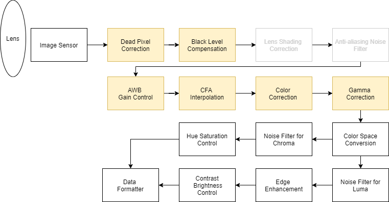

# ISP Image Signal Processor in C

This repo is implementation of ISP in c function, basically it is  re-implemented from [openISP](https://github.com/cruxopen/openISP) in python.  It currently in very first version, I list some [TODO ](#TODO)list to make pipeline more robust.

And you find  something wrong in my implementation, welcome to let [me](lin.lesia@gmail.com) know.

I also need more raw data  with calibration parameters, if someone know where to get, please tell me, I will be soooo glad.




**Function list**

- [x] Dead Pixel Correction

- [x] Black Level Compensation

- [ ] ~~Len Shading Correction~~

  (need calibration parameters)

- [x] Anti-aliasing Noise Filter

- [x] AWB gain Control

- [x] CFA interpolation

  only implement rggb bayer pattern

- [x] Color Correction

- [x] Gamma Correction 

  piecewise LUT

- [x] Color Space Conversion

- [x] Noise Filter for chroma

  - [x] False Color Suppression

- [x] Hue Saturation Control

- [x] Noise Filter for Luma

  - [x] Non local mean denoise
  - [x] Bilateral Filter

- [x] Edge Enhancement

- [x] Contrast Brightness Control

### Usage

build exe file, 

```
mkdir build/
cd build 
cmake ..
cmake --build .
```

then isp_pipeline.exe will in prebuilt/ folder

test isp pipeline

```shell
isp_pipeline.exe test.raw
```

#### Configuration

The configuration can be a adjusted as input raw image.

 In the config file , parameters are floats which are converted to fixed point type in C function to make operation in integer type.

**config.json**

```json
{
    "width": 1920,
    "height": 1080,
    "image_bits": 10,
    "blc": {
        "bl_r": 0,
        "bl_gr": 0,
        "bl_gb": 0,
        "bl_b": 0,
        "alpha": 0.0,
        "beta": 0.0
    },
    "dpc": {
        "dead_thres": 30,
        "mode": "gradient"
    },
    "bayer_pattern": "rggb",
    "cfa_mode": "malvar",
    "awb_gain": {
        "r_gain": 1.5,
        "gr_gain": 1.0,
        "gb_gain": 1.0,
        "b_gain": 1.1
    },
    "ccm": [
        [
            1.0,
            0.0,
            0.0,
            0.0
        ],
        [
            0.0,
            1.0,
            0.0,
            0.0
        ],
        [
            0.0,
            0.0,
            1.0,
            0.0
        ]
    ],
    "gamma": 0.8,
    "csc": [
        [0.257,0.504,0.098,16],
        [-0.148,-0.291,0.439,128],
        [0.439,-0.368,-0.071,128]
    ],
    "nlm":{
        "Ds":4,
        "ds":1,
        "h":5
    },
    "bnf":{
        "dw":[
            [8,12,32,12,8],
            [12,64,128,64,12],
            [32,128,1024,128,32],
            [12,64,128,64,12],
            [8,12,32,12,8]
        ],
        "rw":[0,8,16,32],
        "rthres":[128,32,8]
    },
    "edge_filter":[
        [-1,0,-1,0,-1],
        [-1,0,8,0,-1],
        [-1,0,-1,0,-1]
    ],
    "eeh":{
        "gain_min":32,
        "gain_max":128,
        "thres_min":4,
        "thres_max":16,
        "em_clip_min":-64,
        "em_clip_max":64
    },
    "fcs":{
        "edge_min":32,
        "edge_max":64
    },
    "hsc":{
        "hue_offset":0,
        "saturation_gain":1.3 
    },
    "bcc":{
        "brightness":0,
        "contrast":1.1
    }

}

```


## TODO

- board condition (I didn't handle any board condition in any function)

- lens shading correction (if I have parameters)

- CFA  ( with more bayer pattern)

- color space conversion (with more yuv format)

- Non local mean denoise (optimization in exponential operation)

- bilateral filter (with non-fixed kernel and optimize in fixed point operation)

- False color suppression (the current result is kind of weird, need to find the reference algorithm)s

- Hue Saturation Control (the current result is kind of weird, need to find the reference algorithm)

  

  
